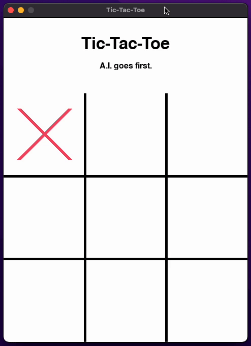

# TicTacToe with A.I. 🧠

This is a very simple TicTacToe game implementation using Python and the minimax algorithm.

<center>
    
</center>

## How to run the application

To run this project, download and install it locally using pip:

```sh
git clone https://github.com/RodolfoFerro/tictactoe-with-ai.git
cd tictactoe-with-ai
pip install -r requirements.txt
```

To run the application, just run the `app.py` file:

```sh
python app.py
```
